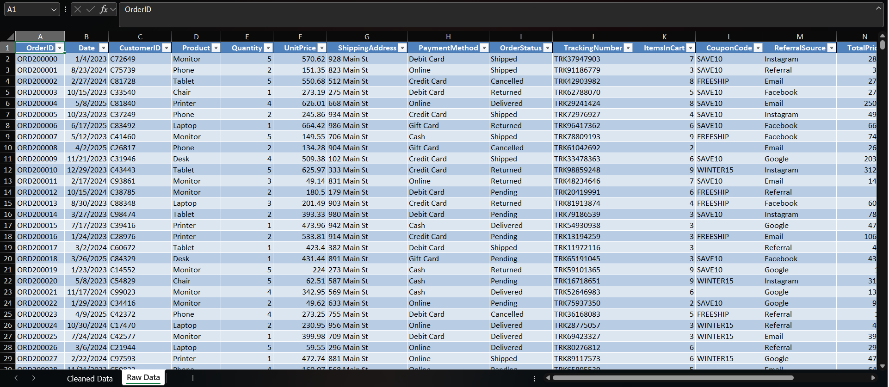
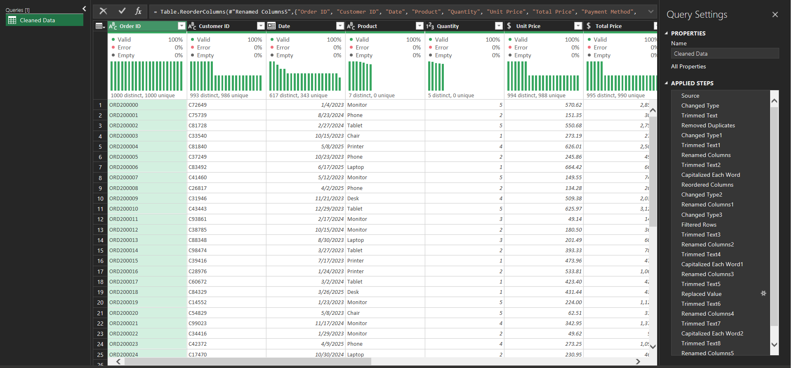
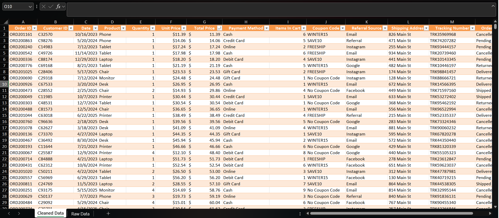
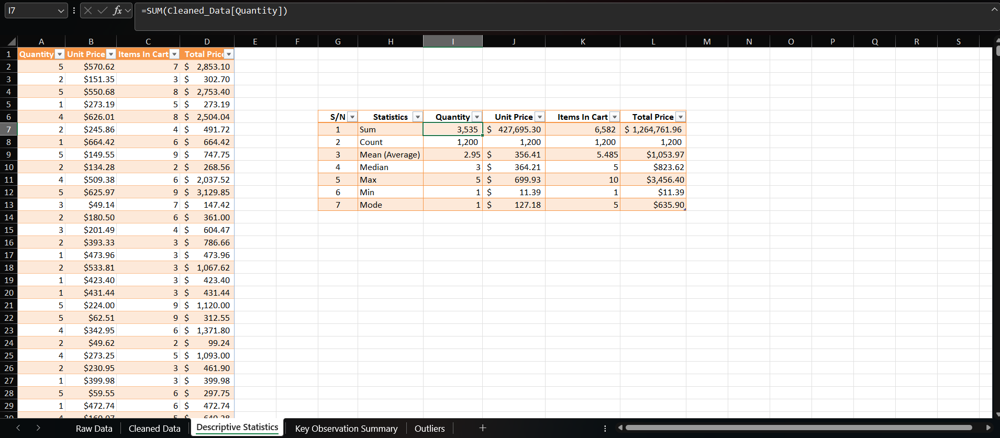
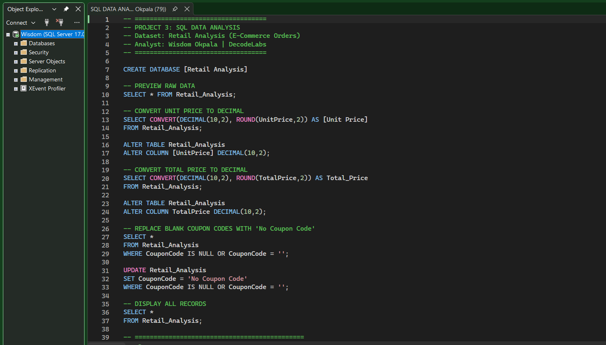
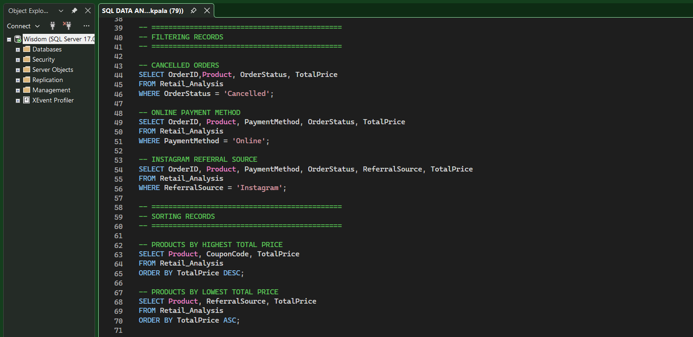
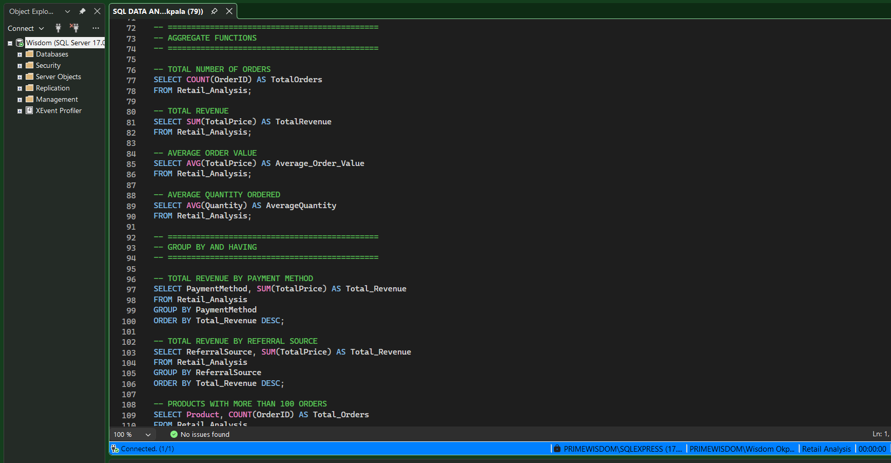
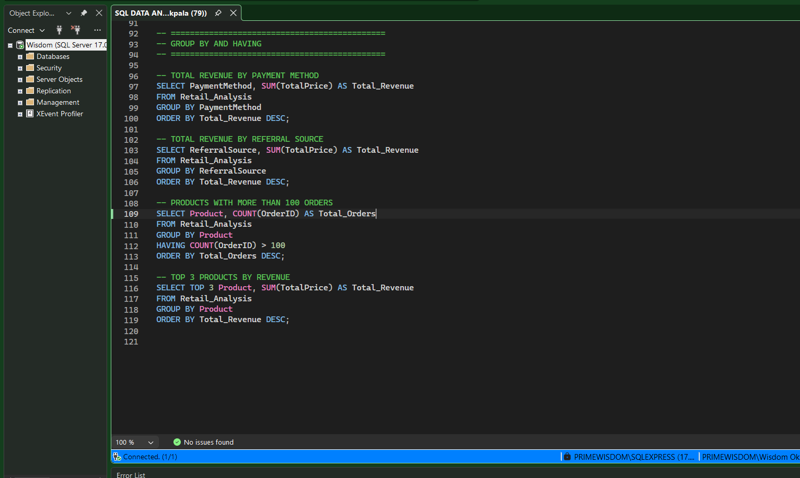

# INTERNSHIP PROJECTS PORTFOLIO
 
## Overview
 
This repository contains data analysis projects completed during my Data Analytics Internship at DecodeLabs. The projects span the full analytics workflow, from data cleaning and preparation through exploratory data analysis, SQL querying, and interactive Power BI dashboard development; using real-world datasets to generate meaningful business insights.
 
---
 
## Project 1: Data Cleaning and Preparation
 
### Project Description
 
The goal of this project was to clean and prepare a raw business dataset for analysis using Microsoft Excel and Power Query. The dataset contained multiple data quality issues including blank cells, duplicate records, and incorrect data types, all of which were identified and resolved to produce a clean, structured dataset ready for reporting.
 
### Objectives
 
- Improve overall data quality
- Remove duplicate records
- Handle missing and blank values
- Correct data types across all columns
- Prepare the dataset for downstream analysis
### Tools Used
 
- Microsoft Excel
- Power Query
### Dataset Information
 
The dataset contained **14 column headers**, **1,201 rows**, and **309 blank cells** across the following fields:
 
| Column | Data Type |
|---|---|
| Order_ID | Text |
| Date | Date |
| Customer_ID | Text |
| Product | Text |
| Quantity | Whole Number |
| Unit_Price | Currency |
| Shipping_Address | Text |
| Payment_Method | Text |
| Order_Status | Text |
| Tracking_Number | Text |
| Items_In_Cart | Whole Number |
| Coupon_Code | Text |
| Referral_Source | Text |
| Total_Price | Currency |
 
### Data Cleaning Process
 
The following cleaning operations were performed in Power Query:
 
1. **Converted the dataset into a Table** — Selected the full range (`Ctrl + A`) and transformed it into an Excel Table (`Ctrl + T`)
2. **Exported to Power Query** — Loaded the table via Data Tab → From Table/Range
3. **Removed errors and corrected data types** — Applied the appropriate data type to each of the 14 columns
4. **Handled blank cells** — The `Coupon_Code` column contained 309 blank cells; all blanks were replaced with `"No Coupon Code"`
5. **Removed duplicates** — Duplicate records were removed from the `Order_ID` column
6. **Exported cleaned data back to Excel** — Via Home Tab → Close and Load
7. **Renamed the output table** — The transformed table was renamed to `Cleaned Data`
---
 
### Messy Dataset
 
> Initial raw dataset before cleaning and transformation.
 

 
---
 
### Power Query Techniques Used
 
- Remove Duplicates
- Replace Values
- Change Data Types
- Add and Merge Columns
- Split Column by Delimiter
- Filtering and Sorting
- Custom Column Transformations
---
 
### Power Query Transformation Steps
 
> Power Query was used to clean, transform, and standardize the dataset through a series of applied steps.
 

 
---
 
### Cleaned Dataset
 
> Dataset after cleaning and preparation using Power Query.
 

 
---
 
### Challenges Faced
 
- Unix timestamps not automatically recognized as dates
- Phone numbers stored in scientific notation requiring text conversion
- Structural nulls that needed to be handled differently from data entry nulls
- Inconsistent college/department naming requiring column splitting and standardization
### Outcome
 
The raw admissions dataset was successfully transformed into a clean, organized, and analysis-ready table. All identified quality issues were resolved, resulting in a dataset suitable for reporting and further analysis.
 
---
 
## Project 2: Exploratory Data Analysis (EDA)
 
### Project Description
 
This project involved performing Exploratory Data Analysis on an e-commerce orders dataset using Microsoft Excel to uncover trends, patterns, and business insights from raw transactional data.
 
### Objectives
 
- Analyze trends and patterns in the dataset
- Summarize data using descriptive statistics
- Identify key performance observations and outliers
- Generate actionable business insights from the data
### Tools Used
 
- Microsoft Excel
- Pivot Tables
- Descriptive Statistics
- IQR Outlier Detection
### Dataset Information
 
A 1,200-row e-commerce orders dataset containing transaction records with fields for order details, product categories, pricing, coupon codes, referral sources, and payment methods.
 
### Analysis Performed
 
- Descriptive statistical analysis
- Pivot table breakdowns by category, payment method, and referral source
- IQR-based outlier detection on revenue and order values
- Trend and category performance analysis
- Coupon code null value handling
### Analytical Techniques Used
 
- Mean, Median, and Mode
- Minimum and Maximum Values
- Standard Deviation
- IQR (Interquartile Range) for Outlier Detection
- Frequency Distribution
- Pivot Table Summarization
- Data Filtering and Sorting
---
 
### Basic Descriptive Statistics
 
> Summary statistics used to understand the dataset distribution.
 

 
---
 
### Pivot Table Analysis
 
> Pivot tables used to summarize and analyze trends across categories, payment methods, and referral sources.
 .png)
 
---
 
### IQR / Outlier Analysis
 
> IQR calculations used to identify data distribution and flag outliers.
 
 .png)
 
---
 
### Key Insights
 
- Certain product categories consistently outperformed others in revenue
- IQR analysis revealed significant outliers in total order values
- Pivot table breakdowns showed clear preference patterns in payment methods and referral sources
- Coupon code usage varied meaningfully across product segments
### Challenges Faced
 
- Inconsistent formatting in raw data required pre-cleaning before analysis
- Large dataset required structured organization to avoid formula errors
- Null coupon code values needed specific handling before aggregation
### Outcome
 
The EDA provided meaningful insights into business performance, customer behavior, and product trends through statistical summaries and pivot-based analysis.
 
---
 
## Project 3: SQL Retail Data Analysis
 
### Project Overview
 
This project involved analyzing an e-commerce orders dataset using Microsoft SQL Server and SQL Server Management Studio (SSMS). The objective was to apply SQL querying, data cleaning, aggregation, and reporting techniques to extract meaningful business insights from retail transaction data.
 
### Tools Used
 
- Microsoft SQL Server
- SQL Server Management Studio (SSMS)
- SQL
### Database Setup and Data Cleaning
 
The dataset was imported into SQL Server from a CSV file. Data cleaning and transformation were performed to improve data quality and prepare the dataset for analysis.
 
**Cleaning tasks performed:**
 
- Replaced blank values in the `CouponCode` column with `"No Coupon"`
- Created additional columns: `Order_Year` and `Order_Month`
- Extracted date values using SQL date functions (`YEAR()`, `MONTH()`)
- Verified and corrected data types where necessary
---
 
### Query Images
 

 
---
 
### SQL Skills and Techniques Applied
 
#### SQL Clauses and Operations
 
- `SELECT`, `WHERE`, `ORDER BY`
- `GROUP BY`, `HAVING`
- `UPDATE`, `ALTER TABLE`
#### Aggregate Functions
 
- `SUM()`, `AVG()`, `COUNT()`
#### Additional SQL Techniques
 
- Date extraction functions (`YEAR()`, `MONTH()`)
- Conditional filtering
- Data aggregation and grouping
- Business reporting queries
 
---
 
### Key Findings and Business Insights
 
#### Overall Metrics Performance
 
| Metric | Value |
|---|---|
| Total Orders | 1,200 |
| Total Revenue | $1,264,761.96 |
| Average Order Value | $1,053.97 |
| Average Quantity Ordered | 2 Items |
| Cancelled Orders | 251 |
 
#### Customer and Payment Insights
 
**Most Used Payment Method:** Online Payments (259 transactions)
 
**Highest Revenue Payment Method:** Credit Card — $263,847.63
 
**Top Referral Source:** Instagram (260 referrals)
 
**Highest Revenue Referral Source:** Instagram — $275,285.45
 
#### Product Performance
 
**Top 3 Products by Revenue**
 
| Product | Revenue |
|---|---|
| Chair | $195,620.11 |
| Printer | $195,612.61 |
| Laptop | $192,126.56 |
 
**Products with Sales Greater than 2,000 Units:**
Chair, Desk, Laptop, Monitor, Phone, Printer, Tablet
 
**Highest Individual Total Price:** Tablet (Coupon: SAVE10) — $3,456.40
 
**Lowest Recorded Price:** Phone (Referral: Email) — $11.39
 
#### Revenue by Payment Method
 
| Payment Method | Total Revenue |
|---|---|
| Credit Card | $263,847.63 |
| Online | $262,442.94 |
| Cash | $259,786.29 |
| Gift Card | $246,323.92 |
| Debit Card | $232,361.18 |
 
#### Revenue by Referral Source
 
| Referral Source | Total Revenue |
|---|---|
| Instagram | $275,285.45 |
| Email | $261,808.55 |
| Google | $250,441.48 |
| Facebook | $250,410.90 |
| Referral | $226,815.58 |
 
### Conclusion
 
This project demonstrated practical SQL and data analysis skills through a real-world retail dataset. SQL queries were used to clean, organize, analyze, and summarize transactional data into actionable business insights covering customer behavior, product performance, payment trends, and revenue distribution.
